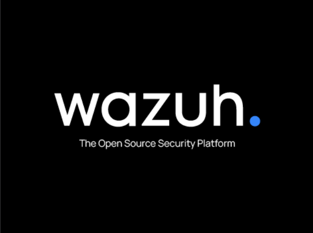

# Enterprise Cybersecurity Lab: Wazuh as EDR, XDR, SIEM & Vulnerability Management

  
*Wazuh Dashboard showing monitored endpoints and security events.*

## Overview

This project demonstrates the deployment and configuration of a complete security operations platform using **Wazuh**, an open‑source solution that unifies **Endpoint Detection & Response (EDR)**, **Extended Detection & Response (XDR)**, **Security Information and Event Management (SIEM)**, and **Vulnerability Management**. The lab environment consists of a Wazuh server and three agent machines (two Ubuntu 20.04, one Windows 10). Realistic attack scenarios are simulated to validate detection, alerting, and reporting capabilities.

## Objectives

- Deploy a fully functional Wazuh infrastructure using a pre‑built OVA.
- Integrate heterogeneous agents (Linux and Windows) for centralized log collection.
- Configure core Wazuh modules: **File Integrity Monitoring (FIM)**, **Vulnerability Detector**, and **Active Response**.
- Simulate attack scenarios (SSH brute‑force, file tampering, vulnerable software installation) and verify detection.
- Map detected threats to the **MITRE ATT&CK** framework.
- Produce a documented, repeatable lab environment suitable for portfolio or interview demonstration.

## Technologies Used

| Component          | Description                                  |
|--------------------|----------------------------------------------|
| **Wazuh OVA 4.x**  | All‑in‑one server (Manager, Indexer, Dashboard) |
| **VirtualBox**     | Hypervisor for all virtual machines          |
| **Ubuntu 20.04**   | Two Linux agents                             |
| **Windows 10**     | One Windows agent                            |
| **Wazuh Agent**    | Installed on each endpoint for data collection |
| **Testing Tools**  | `hydra`, `nmap`, manual file edits, outdated packages |

## Architecture

             +------------------------------+
             |       Wazuh Server (OVA)     |
             |  - Manager                   |
             |  - Indexer (OpenSearch)      |
             |  - Dashboard (Kibana)        |
             +---------------+--------------+
                             |
          Internal Network   |
     +------------------+   |    +------------------+    +------------------+
     | Ubuntu Agent VM1 |---+----| Ubuntu Agent VM2 |    | Windows 10 VM    |
     | (Wazuh Agent)    |        | (Wazuh Agent)    |    | (Wazuh Agent)    |
     +------------------+        +------------------+    +------------------+


- All VMs connected via VirtualBox **internal network** (`intnet`) with static IPs.
- Wazuh server IP: `192.168.56.102`
- Agents communicate with the server over this isolated network.

## Setup & Installation

### 1. Deploy Wazuh Server
- Import the Wazuh OVA into VirtualBox (allocate 4 vCPU, 4 GB RAM).
- Set network adapter to **internal network** (`intnet`).
- Boot the VM and note its IP address (`ip a`).
- Access the dashboard at `https://<WAZUH_IP>:5601` (default credentials: `admin/admin`).

### 2. Add Linux Agents (Ubuntu 20.04)
Create two Ubuntu 20.04 VMs (2 vCPU, 2 GB RAM, network `intnet`). On each:

```bash
# Add Wazuh repository and install agent
curl -s https://packages.wazuh.com/key/GPG-KEY-WAZUH | sudo apt-key add -
echo "deb https://packages.wazuh.com/4.x/apt/ stable main" | sudo tee /etc/apt/sources.list.d/wazuh.list
sudo apt update && sudo apt install wazuh-agent -y

# Configure manager IP
sudo sed -i 's/<address>.*<\/address>/<address>192.168.56.102<\/address>/' /var/ossec/etc/ossec.conf
sudo systemctl enable --now wazuh-agent
```

On the Wazuh server, register each agent and obtain a key, then insert the key on the agent.
### 3. Add Windows Agent

    Create a Windows 10 VM (2 vCPU, 2 GB RAM, intnet + temporary NAT for downloading).

    Download the Wazuh agent MSI from packages.wazuh.com.

    Install silently:
    powershell

    msiexec /i wazuh-agent.msi /qn WAZUH_MANAGER='192.168.56.102' WAZUH_AGENT_NAME='win10lab'

    Register the agent on the server and assign its key.

### 4. Verify Agents

In the Wazuh Dashboard, navigate to Agents – all three endpoints should appear with status Active.


#### Attack Scenarios & Validation
#### 1. SSH Brute‑Force Detection

Goal: Test Wazuh’s ability to detect multiple failed SSH logins.

Simulation (from soc101):
bash

for i in {1..20}; do ssh wrong@192.168.56.103; done

Expected Result:

    Wazuh generates alerts for authentication failures.

    View in Security Events → Authentication Failures.


Wazuh Capabilities:

    EDR: Endpoint login monitoring.

    SIEM: Centralized log aggregation.

    Active Response (if configured): automatic IP blocking.

#### 2. File Tampering (FIM)

Goal: Trigger File Integrity Monitoring by modifying a critical system file.

Steps on soc2:

    Verify /etc is monitored in /var/ossec/etc/ossec.conf.

    Reduce scan interval to 60 seconds (for testing) and restart agent.

    Simulate unauthorized change:
    bash

    sudo bash -c 'echo "#MALICIOUSLINE" >> /etc/passwd'

Expected Result:

    FIM alert generated within one minute.

    View in Security Events → FIM Alerts.


Wazuh Capabilities:

    EDR: Local file tampering detection.

    SIEM: Integrity violation logging.

#### 3. Vulnerability Detection

Goal: Detect outdated software with known CVEs.

Steps on soc2:

    Install an older, vulnerable Apache version:
    bash

    sudo apt install apache2=2.4.29-1ubuntu4

    Ensure Vulnerability Detector is enabled in the dashboard.

Expected Result:

    Wazuh fetches CVEs for the installed package.

    View in Vulnerabilities module, with detailed CVE information.


Wazuh Capabilities:

    Vulnerability Management: Real‑time CVE analysis.

    SIEM: Enriched logs with vulnerability context.

    XDR: Correlation with other threat data.

##### Additional Insights
##### MITRE ATT&CK Mapping

Wazuh automatically maps detected techniques to the MITRE ATT&CK framework. This provides SOC teams with actionable adversary context.


##### Endpoint Inventory

Each agent page displays installed software, running processes, and open network connections – essential for asset visibility and threat surface analysis.


##### Results Summary
|Threat Vector |	Wazuh Capability	| Verification Path |
|---------|-------|---------|
|SSH brute-force |	EDR, SIEM, Active Response |	Dashboard > Security Events > Authentication Failures |
|File tampering |	FIM, EDR, SIEM |	Dashboard > Security Events > FIM Alerts |
|Vulnerable software |	VM, SIEM |	Dashboard > Vulnerabilities |


The lab successfully demonstrated real‑time detection and alerting for all simulated attacks, with clear visibility in the Wazuh Dashboard.
## Lessons Learned

    Rapid deployment: The Wazuh OVA simplifies setup, allowing focus on configuration and testing.

    Agent integration: Both Linux and Windows agents integrate seamlessly, with consistent policy management.

    FIM tuning: Scan intervals must be balanced between detection speed and system performance.

    Vulnerability detection: Accurate CVE matching requires up‑to‑date vulnerability feeds.

    MITRE mapping: Enhances threat intelligence and reporting.

    Practical experience: Simulating attacks in a safe lab environment builds confidence and deepens understanding of detection logic.

## Future Improvements

    Add a fourth agent (macOS or Alpine Linux) to test cross‑platform coverage.

    Integrate Suricata or Zeek for network‑level detection.

    Implement active response scripts (e.g., automatic IP blocking).

    Deploy a Wazuh cluster for high availability.

    Connect Wazuh with TheHive/Cortex for incident response orchestration.

Author: Esso Maléki TONINZIBA
